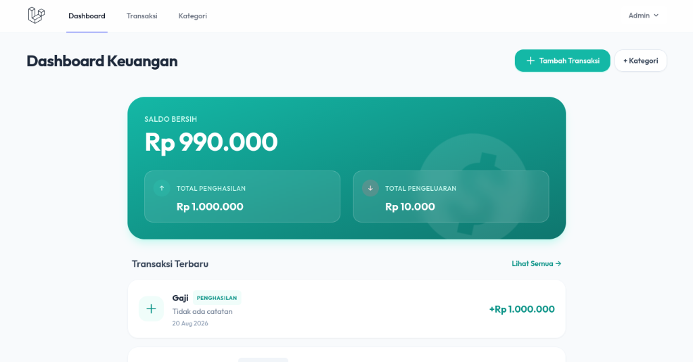

<p align="center">
  <h1 align="center">💰 Ngesak — Aplikasi Manajemen Keuangan Personal</h1>
  <p align="center">
    Aplikasi pencatatan keuangan pribadi yang simpel, modern, dan responsif dibangun dengan Laravel & Tailwind CSS.
  </p>
</p>

---

## 📸 Preview Aplikasi

<p align="center">
  
</p>

---

## ✨ Fitur Utama

- 📊 **Dashboard Keuangan Modern**
  - Ringkasan Saldo Bersih, Total Pemasukan, dan Total Pengeluaran secara real-time.
  - Tampilan *Hero Card* dengan gradien gelap dan efek *glow* yang elegan.
  - Akses cepat transaksi terbaru.

- 💸 **Manajemen Transaksi (CRUD)**
  - Pencatatan transaksi Pemasukan (Income) dan Pengeluaran (Expense).
  - Pemfilteran Kategori otomatis berdasarkan tipe transaksi menggunakan Alpine.js.
  - Kartu riwayat transaksi interaktif dengan animasi hover dan aksi edit/hapus cepat.

- 🏷️ **Manajemen Kategori**
  - Pengelompokan transaksi berdasarkan kategori kustom.

- 🎨 **Desain UI/UX Premium**
  - Menggunakan **Tailwind CSS** dengan skema warna Teal & Rose.
  - Sentuhan *Glassmorphic*, sudut membulat (*rounded-2xl / 3xl*), dan animasi mikro responsif.

- 🔐 **Autentikasi & Keamanan**
  - Dilengkapi sistem autentikasi aman dengan Laravel Breeze.

---

## 🛠️ Teknologi yang Digunakan

- **Backend**: Laravel 11.x (PHP 8.2+)
- **Frontend**: Blade Templating, Tailwind CSS, Alpine.js
- **Database**: MySQL / SQLite
- **Build Tool**: Vite

---

## 🚀 Panduan Instalasi & Penggunaan

Ikuti langkah-langkah berikut untuk menjalankan proyek di lingkungan lokal:

### 1. Clone Repositori
```bash
git clone https://github.com/rifqieali/Ngesak.git
cd Ngesak
```

### 2. Install Dependensi
```bash
# Install PHP dependencies
composer install

# Install JavaScript dependencies
npm install
```

### 3. Konfigurasi Environment
```bash
cp .env.example .env
php artisan key:generate
```

Sesuaikan pengaturan database di file `.env`:
```env
DB_CONNECTION=mysql
DB_HOST=127.0.0.1
DB_PORT=3306
DB_DATABASE=ngesak
DB_USERNAME=root
DB_PASSWORD=
```

### 4. Migrasi & Seeder Database
```bash
php artisan migrate --seed
```

### 5. Jalankan Aplikasi
Buka 2 terminal terpisah:

**Terminal 1 (Vite Asset Bundler):**
```bash
npm run dev
```

**Terminal 2 (Laravel Development Server):**
```bash
php artisan serve
```

Aplikasi dapat diakses melalui browser di `http://127.0.0.1:8000`.

---

## 📝 Lisensi

Proyek ini dibuat untuk tujuan pembelajaran dan pengembangan personal di bawah lisensi [MIT](LICENSE).
